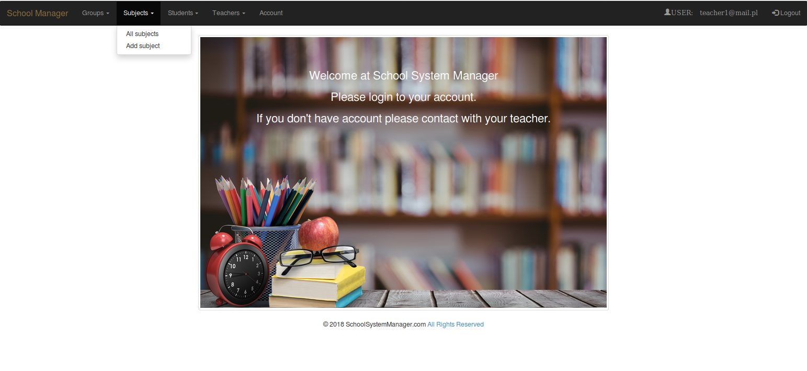
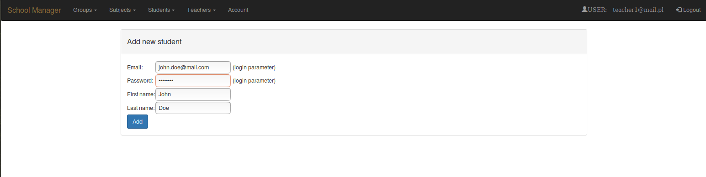
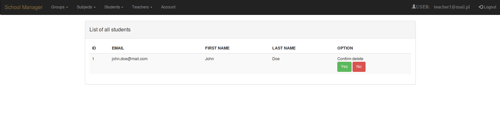
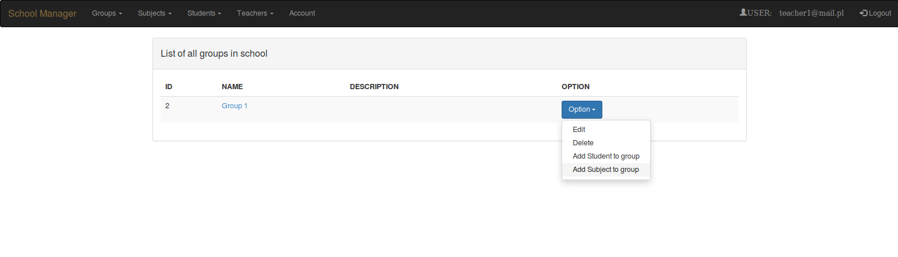

# School-manager

Simple web application for teachers and students/parents to inform about grades and learning progress

## Basic Function

- Login as Teacher
	- add, edit, remove (group, student, subject, other teacher)
	- add, edit marks for specyfic student (with description)	
- Login as Student
	- preview of own marks

### Following technologies being used:

- Apache Maven 3.5.0
- Spring 4.3.9.RELEASE
- Hibernate 5.2.9.Final
- Mysql 5.7.20
- Bootstrap 3, Html, Css
- Tomcat 8.0
- Spring Tool Suite 3.9.1.RELEASE

## Screenshots - Teacher account

- main menu

- add new student

- group options

- add mark

- password validation
[password validation](screenshots/05_screen.png "password validation")

## Comming features

- login function implemented into Teacher and Student class
- new admin account with more privileges 
- authentication and access-control with Spring Security
- removing known errors and handling exception
- more intuitive look and access to implemented features
